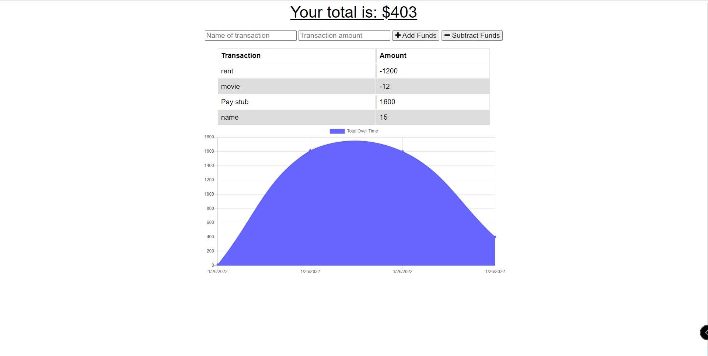

# Budget Tracker

## Description
Budget Tracker is a PWA designed for you to track your withdrawals or deposits with or without an internet connection. 

## Table of Contents
* [Installation](#installation)
* [Usage](#usage)
* [Questions](#questions)

## Installation
* Install Node.js on your computer if you don't have it already
* Type 'npm install' in the command line terminal
* Type 'npm start' in the command line terminal
* Type 'localhost:3001' in your browser to view the application

You can also use the application on [Heroku](https://still-tor-93688.herokuapp.com/) 

## Usage
* As mentioned above, this application was built for tracking your funds.
* Clicking the [link](https://still-tor-93688.herokuapp.com/) to the deployed application will bring to the main page.
* To get started, add a name for the expense or deposit.
* Add the dollar amount for the transaction.
* Select whether to add or subtract funds.
* The amount added or subtracted will be tracked via text and with a graph.

## Questions
* Email me at <a href= "mailto: brendanjflewis@icloud.com">brendanjflewis@icloud.com</a>
* Check out my Github profile at <a href= "https://www.github.com/brendanjflewis">brendanjflewis</a>